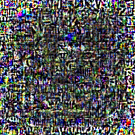

# adversarial-images

Exploring adversarial image attacks.

## Getting Started

1. Setup your uv environment. (`uv init`, `uv sync`, `source .venv/bin/activate`)
2. Experiments are located in the `exp` directory. For examples on how to run them, see `scripts/experiment.sbatch`.
    - Note: I use conda for uv just because it's easier on the MIT cluster, but this is not necessary. All the dependencies are on uv alone.
    - Note: Any datasets needed should automatically be downloaded.
    - Note: llava model currently not functional
