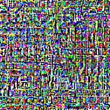

# adversarial-images

Exploring adversarial image attacks. Below is an example of an "attack" on Qwen 2.5 VL 7B.

**Prompt**:

Describe what's in this image.

**Response**:

The image appears to be a snippet of text from a document or a book, discussing the concept of "theoretical physics" and its relationship with "mathematics." It mentions that theoretical physics is a branch of physics that uses mathematical models and theories to describe and predict physical phenomena. The text also references the work of mathematicians like Euler, who contributed significantly to the field of mathematics, and suggests that theoretical physics is closely related to mathematics, as it often relies on mathematical concepts and theories to formulate its models and theories.

## Getting Started

1. Setup your uv environment. (`uv init`, `uv sync`, `source .venv/bin/activate`)
2. Experiments are located in the `exp` directory. For examples on how to run them, see `scripts/experiment.sbatch`.
    - Note: I use conda for uv just because it's easier on the MIT cluster, but this is not necessary. All the dependencies are on uv alone.
    - Note: Any datasets needed should automatically be downloaded.
    - Note: llava model currently not functional
